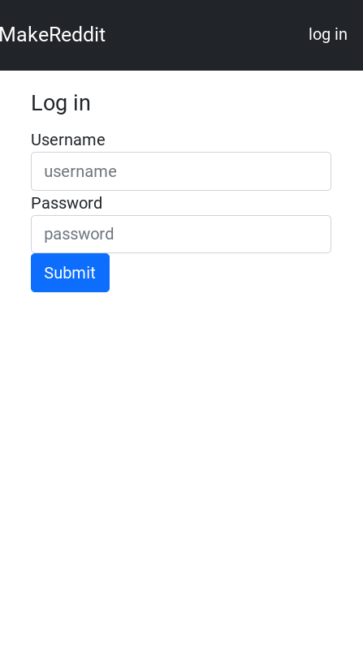
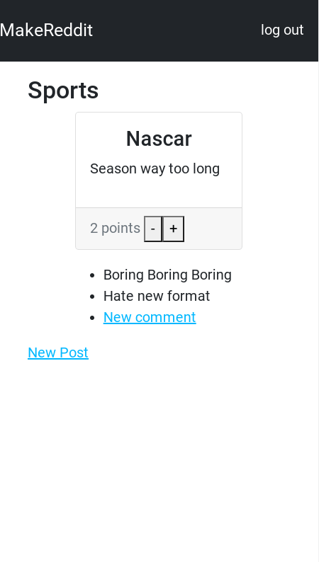

<h1 align="center">Make Reddit</h1>

   Tutorial from  <a href="https://makeschool.org/mediabook/oa/tutorials/makereddit/00-get-started/" target="_blank">makeschool.org</a>.

## Table of Contents

- [Overview](#overview)
  - [Built With](#built-with)
- [Features](#features)
- [Improvements](#improvements)
- [Useful Resources](#useful-resources)

## Overview

MakeSchool was a coding bootcamp that went under.  Most content was made free and I found this and decided to follow along.

To run, git clone and add a Mongo connection string from Mongo Atlas.

### Built With

- Express
- Handlebars
- Mongoose
- Bcrypt
- Bootstrap

## Features

Can make rooms and posts linked to rooms and comments linked to posts.  No deleting of comments - probably best tied to admin account and using authentication to restrict access.    

## Improvements

- Handlebars has problems with prototype pollution.  
- Issues with bootstrap cdn 
- Add helmet

### Resources

- npx express-generator --view=hbs ______ (project name) 

- [YouTube](https://www.youtube.com/watch?v=EjhVucMRMbM) - Set up express
- [Snyk](https://snyk.io/vuln/SNYK-JS-HBS-1566555) - hbs vulnerability
- [Github](https://securitylab.github.com/advisories/GHSL-2021-020-pillarjs-hbs/) - security advisory hbs
- [Stack Overflow](https://stackoverflow.com/questions/30051236/argument-passed-in-must-be-a-string-of-24-hex-characters-i-think-it-is) - warning hbs
